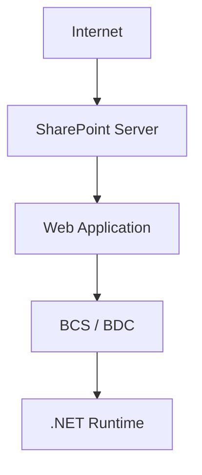

# Phân tích chuỗi khai thác SharePoint CVE-2026-55040 và CVE-2026-63520: Từ Authentication Bypass đến RCE

> Chuỗi hoàn chỉnh gồm **CVE-2026-55040** để bypass xác thực + **CVE-2026-63520** để thực thi mã. VulCheck mô tả chính xác chuỗi này là remote unauthenticated auth bypass (RCE).

<div style="text-align: Justify;">
Trước khi đi vào chi tiết **CVE_2026-55040** và **CVE-2026-63520**, chúng ta cần hiểu sơ bộ cách các thành phần bên trong SharePoint liên kết với nhau. Chuỗi khai thác không đơn giản là attacker gửi một request rồi SharePoint trực tiếp thực thi lệnh, thay vào đó attacker lợi dụng 1 chức năng hợp lệ của SharePoint là **Business Connectivity Services (BCS) và Business Data Connectivity (BDC)** để khiến SharePoint tạo và sử dụng 1 object .NET không an taonf
Có thể hình dung kiến trúc SharePoint Server như sau:
</div>



## 1. SharePoint Web Application
Điểm đầu tiên mà người dùng tương tác là **SharePoint Web Application**, người dùng truy cập SharePoint thông qua trình duyệt hoặc API:
```text
┌──────────┐
│   User   │
└────┬─────┘
     │ HTTPS
     ▼
┌────────────────────────────┐
│ SharePoint Web Application │
└────────────────────────────┘
```


Mục đích cuối cùng của attacker khiến:
```mermaid
flowchart TD
    A[SharePoint] --> B[.NET Runtime]
    B --> C[tạo object do attacker lựa chọn]
    C --> D[gọi 1 method do attacker lựa chọn]
    D --> E[xử lý dữ liệu]
    E --> F[RCE]
  ```
  
